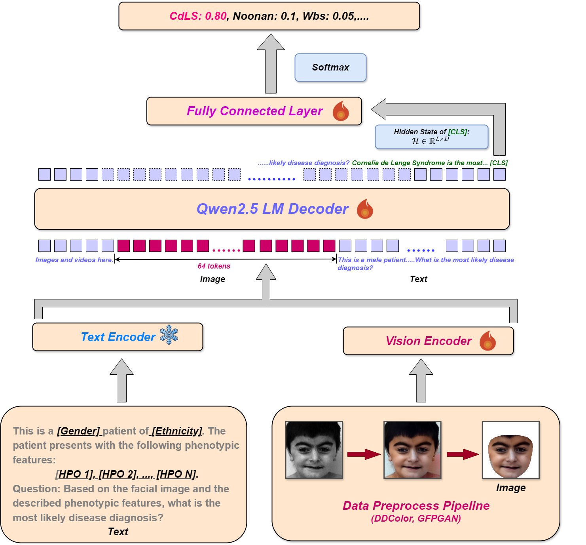
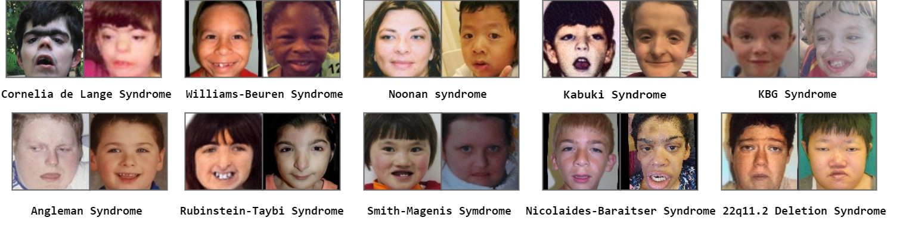
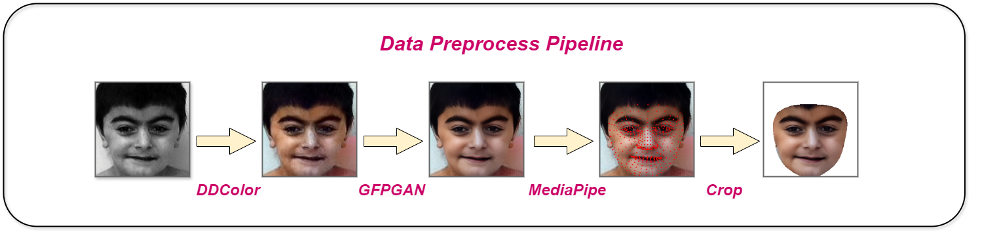

# GestaltM<sup>2</sup>D-VL: *M*ultimodal Vision–Language Diagnosis of *M*endelian Rare Diseases

> **GestaltM<sup>2</sup>D-VL** (Gestalt Multimodal Model for Mendelian Disease Diagnosis with Vision–Language Integration)  
> A **diagnosis-first** multimodal model that leverages **facial images** and **HPO-encoded clinical text** for **Mendelian rare disease diagnosis**.  
> Additionally, we train **StyleGAN3** on GMDB faces to generate **synthetic facial images** used for **qualitative evaluation and analysis**.

---

### Overall pipeline (Diagnosis-centric)

<p align="center">
  
</p>

### Example faces & HPO text

<p align="center">
  
</p>

---

## Table of Contents

1. [Project Overview](#1-project-overview)
2. [Dataset: GMDB Ten-Disease Subset](#2-dataset-gmdb-ten-disease-subset)
3. [Data Preprocessing Pipeline](#3-data-preprocessing-pipeline)
4. [Part I – GestaltM³D-VL for Multimodal Diagnosis](#4-part-i--gestaltm³d-vl-for-multimodal-diagnosis)
5. [Part II – StyleGAN3 Synthesis for Evaluation](#5-part-ii--stylegan3-synthesis-for-evaluation)
6. [Repository Structure](#6-repository-structure)
7. [Installation](#7-installation)
8. [Data Preparation](#8-data-preparation)
9. [Training & Evaluation](#9-training--evaluation)
10. [Figures to Include](#10-figures-to-include)
11. [Citation](#11-citation)
12. [License & Disclaimer](#12-license--disclaimer)

---

## 1. Project Overview

This repository implements a **disease-diagnosis–centric** pipeline on the **GMDB ten-disease subset** (and optionally CHOP cohorts):

1. **Part I – GestaltM³D-VL (Main Contribution: Multimodal Diagnosis)**
   - A **vision–language model** based on **Qwen-VL** that ingests:
     - Preprocessed **facial images**.
     - **HPO-encoded clinical text** (with or without demographics).
   - Outputs **Mendelian rare disease labels** under a **long-tailed** label space.
   - Uses **Class-Balanced Focal Loss** to focus on **rare diseases**.

2. **Part II – StyleGAN3-based Synthesis (Support: Evaluation & Visualization)**
   - Train **class-conditional StyleGAN3** on GMDB faces.
   - Generate **synthetic facial images**:
     - For **qualitative evaluation** of disease-specific gestalt.
     - For **visual case studies** comparing predicted diseases and synthetic exemplars.
   - StyleGAN3 is **auxiliary**; the **primary focus** is the diagnosis model.

<p align="center">
  
</p>

---

## 2. Dataset: GMDB Ten-Disease Subset

We use the **GestaltMatcher Database (GMDB)**, which pairs:

- **Facial images**
- **HPO-encoded clinical text**
- **Demographic information** (ethnicity, age, sex)

Overall label space: **528 syndromes/disorders** (244 frequent, 284 rare).  
In this repository we focus on the **ten diseases with the most distinctive facial phenotypes**, curated by clinical geneticists.

Key stats for the **ten-disease subset**:

- **1,847 cases** with patient-level splits.
- **Test set**: only **HPO-annotated cases** (≈ 818 cases).
- Non-HPO cases are used **only as data augmentation** during training.

> ⚠️ **Dataset access**  
> GMDB (and CHOP, if used) are **not included** in this repository.  
> You must obtain data access following your **institutional, IRB, and data-use agreements**, then place the files under `data/raw/`.

<p align="center">
  
</p>

---

## 3. Data Preprocessing Pipeline

Original facial images in GMDB/CHOP often suffer from:

- Low resolution, blur
- Grayscale or washed-out colors
- Cluttered backgrounds

We build a **three-stage preprocessing pipeline** shared by both the diagnosis model and StyleGAN3:

1. **Color Restoration – DDColor**
   - Colorize grayscale / washed-out facial images.

2. **Face Restoration & Super-Resolution – GFPGAN**
   - Enhance facial details and upsample low-resolution faces.

3. **Face Detection & Normalization – MediaPipe Face Detection**
   - Detect faces and perform **tight cropping**.
   - Remove background and resize to **224×224** RGB.
   - Normalize input space and control token budget for the multimodal LLM.

The script `src/data/preprocess_faces.py` orchestrates DDColor, GFPGAN, and MediaPipe and writes processed images into `data/processed/images`.

<p align="center">
  
</p>

---

## 4. Part I – GestaltM³D-VL for Multimodal Diagnosis

> ✅ **This is the main part of the project.**  
> All other components (e.g., StyleGAN3) are designed to support or analyze this diagnosis model.

### 4.1 Motivation

We target **Mendelian rare disease diagnosis** from:

- **Facial gestalt** (front-view facial images).
- **HPO-encoded clinical text** (+/- demographics).

Challenges:

- GMDB is **highly long-tailed** (many rare diseases with few examples).
- Data is **noisy** (missing HPO terms, variable image quality).
- Standard cross-entropy tends to overfit **head classes** and underperform on rare diseases.

### 4.2 Backbone: Qwen-VL Family

GestaltM³D-VL is built on **Qwen-VL** models:

- **Qwen-2-VL-7B-Instruct**
- **Qwen-2.5-VL-7B-Instruct** (default backbone)
- (Optional) **Qwen-3-VL-8B-Instruct**

Advantages:

- Strong **vision–language alignment**.
- Good **parameter–compute trade-off** (7–8B).
- Handles **long, noisy clinical text**.

### 4.3 Model Architecture (Sequence Classification)

We adapt Qwen-VL into a **multimodal sequence classifier**:

1. **Inputs**:
   - `image`: 224×224 preprocessed facial image.
   - `text`:
     - HPO-encoded phenotypes (primary signal).
     - Optional demographics (often **dropped** to reduce bias).

2. **Multimodal encoding**:
   - Construct an instruction-style prompt that embeds HPO terms into natural language.
   - Feed image + text into Qwen-VL.
   - Obtain the hidden state at a special **`[CLS]` token** (or equivalent pooled representation).

3. **Classifier head**:
   - Apply a small **MLP/Linear(D → #classes)** head to predict disease logits.

4. **Loss**:
   - Use **Class-Balanced Focal Loss** to handle severe imbalance.

<p align="center">
  
</p>

### 4.4 Loss: Class-Balanced Focal Loss

Let \( n_y \) be the number of samples of class \( y \).  
We compute effective class weights \( \alpha_y \) based on the **effective number of samples** (e.g., Cui et al., CVPR 2019) and adopt **focal loss** with focusing parameter \( \gamma \):

- Increases the importance of **rare diseases**.
- Focuses training on **hard examples** instead of easy head-class samples.

Implementation:

- `src/models/mm_llm/losses.py`

### 4.5 Training Strategy

Typical strategy:

- Freeze a large portion of the **text backbone**.
- Optionally partially freeze the **vision backbone**.
- Train:
  - Multimodal projector layers.
  - Top transformer blocks (via LoRA or full finetuning).
  - Final classifier head.

Training entry point:

- `src/models/mm_llm/train_mm_llm.py`
- `scripts/train_mm_llm.sh`

Evaluation:

- `src/models/mm_llm/evaluate_mm_llm.py`
- `scripts/eval_mm_llm.sh`

### 4.6 Empirical Observations (internal)

- **Multimodal (image + text) > image-only**.
- Dropping demographics can **maintain or improve** performance and reduce explicit reliance on ethnicity/age/sex.
- Upgrading from Qwen-2-VL to **Qwen-2.5-VL** improves overall diagnosis accuracy and especially rare-class performance.

---

## 5. Part II – StyleGAN3 Synthesis for Evaluation

> ℹ️ **StyleGAN3 is auxiliary** in this repository.  
> Its role is to **support evaluation and visualization** of rare disease facial gestalt, not to perform diagnosis itself.

### 5.1 Goal

We use **StyleGAN3** as a **class-conditional face generator** trained on GMDB ten-disease faces. Synthetic images are used to:

- Visualize **disease-specific facial patterns** learned from GMDB.
- Provide **synthetic exemplars** for:
  - Teaching materials
  - Qualitative comparison with GestaltM³D-VL predictions
- Optionally stress-test robustness (e.g., more varied poses, ages, or subtle changes).

### 5.2 StyleGAN3 Overview (Short)

- Alias-free generation for better geometric consistency.
- Class-conditional setup across ten disease classes (+ optional unaffected class).
- Trained on the **same preprocessed 224×224 faces** used by GestaltM³D-VL.

<p align="center">
  
</p>

### 5.3 Training & Sampling

Configuration (see `configs/stylegan3/ten_disease_default.yaml`):

- Dataset: preprocessed GMDB faces.
- Classes: 10 diseases (+/- unaffected).

Run:

```bash
bash scripts/train_stylegan3.sh
bash scripts/sample_stylegan3.sh
```

This will populate:

```text
data/processed/stylegan3_samples/
  disease_0/
  disease_1/
  ...
```

with class-conditional synthetic faces.

### 5.4 Using Synthetic Images

You can use the synthetic images to:

- Build **grids of synthetic faces per disease**.
- Compare **real patient images & model predictions** with:
  - Synthetic faces from the predicted disease.
- Support **case studies** and **clinical teaching** materials.

<p align="center">
  
</p>

<p align="center">
  
</p>

---

## 6. Repository Structure

Diagnosis is the core; StyleGAN3 is auxiliary:

```text
.
├── README.md
├── LICENSE
├── requirements.txt
├── environment.yml
├── configs/
│   ├── mm_llm/
│   │   └── qwen2_5_vl_ten_disease.yaml
│   └── stylegan3/
│       └── ten_disease_default.yaml
├── data/
│   ├── raw/
│   ├── processed/
│   │   └── stylegan3_samples/
│   └── splits/
│       └── ten_disease/
│           ├── train.csv
│           ├── val.csv
│           └── test.csv
├── docs/
│   └── figures/
│       ├── overview_pipeline.png
│       ├── example_cases.png
│       ├── dataset_stats.png
│       ├── preprocessing_pipeline.png
│       ├── mm_llm_architecture.png
│       ├── stylegan3_overview.png
│       ├── stylegan3_synthetic_examples.png
│       └── method_block_diagram.png
├── src/
│   ├── data/
│   │   ├── gmdb_dataset.py
│   │   ├── preprocess_faces.py
│   │   └── build_splits.py
│   ├── models/
│   │   ├── mm_llm/
│   │   │   ├── mm_classifier.py
│   │   │   ├── losses.py
│   │   │   ├── train_mm_llm.py
│   │   │   └── evaluate_mm_llm.py
│   │   └── stylegan3/
│   │       ├── train_stylegan3.py
│   │       └── sample_stylegan3.py
│   └── utils/
│       ├── config.py
│       ├── logging_utils.py
│       ├── metrics.py
│       └── seed.py
└── scripts/
    ├── prepare_gmdb.sh
    ├── train_mm_llm.sh
    ├── eval_mm_llm.sh
    ├── train_stylegan3.sh
    └── sample_stylegan3.sh
```

---

## 7. Installation

### 7.1 Conda environment

```bash
conda env create -f environment.yml
conda activate gestaltm3d-vl
```

### 7.2 Pip

```bash
python -m venv .venv
source .venv/bin/activate  # on Windows: .venv\Scripts\activate
pip install -r requirements.txt
```

`requirements.txt` (sketch):

- `torch`, `torchvision`, `torchaudio`
- `transformers`, `accelerate`, `bitsandbytes` (optional)
- `timm`
- `opencv-python`, `mediapipe`
- `gfpgan`, `ddcolor`
- `scikit-learn`
- `pandas`, `numpy`
- `matplotlib`, `seaborn`
- `rich`, `pyyaml`

---

## 8. Data Preparation

### 8.1 Place raw data

Place GMDB (and optional CHOP) metadata and images under:

```text
data/raw/
  gmdb_metadata.csv
  images/
    patient_*.jpg
```

> The exact file naming depends on your internal export.  
> Adjust in `src/data/build_splits.py` and `src/data/preprocess_faces.py` accordingly.

### 8.2 Build patient-level splits

```bash
python -m src.data.build_splits \
  --input_meta data/raw/gmdb_metadata.csv \
  --output_dir data/splits/ten_disease
```

Creates:

- `train.csv`
- `val.csv`
- `test.csv`

with columns such as:

- `image_path`
- `disease_label`
- `hpo_text`
- `demographics` (optional)

### 8.3 Run facial preprocessing

```bash
python -m src.data.preprocess_faces \
  --input_dir data/raw/images \
  --meta_csv data/splits/ten_disease/train.csv \
  --output_dir data/processed/images
```

Repeat or adapt for val/test splits.

---

## 9. Training & Evaluation

### 9.1 GestaltM³D-VL (Main)

```bash
# Train GestaltM3D-VL on GMDB ten-disease subset
bash scripts/train_mm_llm.sh

# Evaluate on held-out test set
bash scripts/eval_mm_llm.sh
```

Control hyperparameters and backbone in:

- `configs/mm_llm/qwen2_5_vl_ten_disease.yaml`

### 9.2 StyleGAN3

```bash
# Train StyleGAN3 on preprocessed GMDB faces
bash scripts/train_stylegan3.sh

# Sample synthetic faces per disease class
bash scripts/sample_stylegan3.sh
```

Synthetic samples are stored in:

- `data/processed/stylegan3_samples/`

---


## Citation

```bibtex
placeholder
```

Also consider citing:

- GestaltMatcher / GMDB / GestaltMML
- Qwen2-VL / Qwen2.5-VL / Qwen3-VL technical reports
- StyleGAN3, DDColor, GFPGAN, MediaPipe

---

## License & Disclaimer

- **License**: MIT LICENSE.  
- **Data**: This repository does **not** include patient-identifiable GMDB/CHOP data.  
- **Usage**:
  - Any use of real patient data must follow **IRB**, **data-use agreements**, and **local regulations**.
  - Synthetic images are intended for **research** and **evaluation** only.

> This repository is for **research** and **method development** only.  
> It is **not** a certified medical device and should not be used directly for clinical decision-making without thorough validation and regulatory approval.
